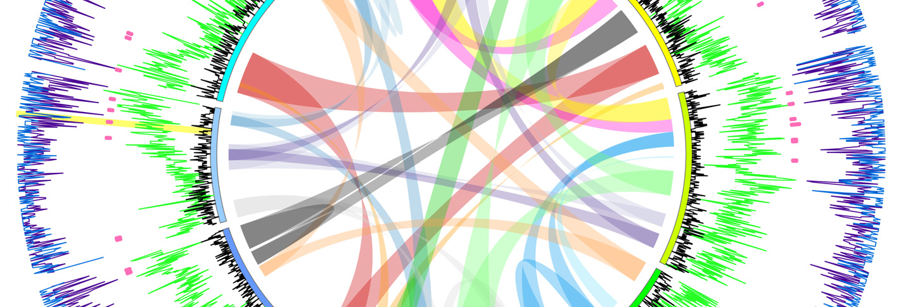
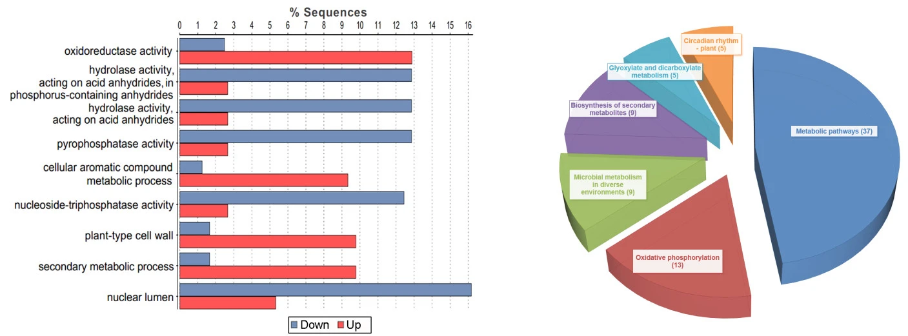

### _Brassica napus_ pan-genome

We combine Pacbio, HiC, and Bionano sequencing to _de novo_ assemble high-quality genomes of two subspecies of _Brassica napus_: Siberian kale and rutabaga. Subsequently, we will construct species level _B. napus_ pan-genome, and further investigate the association between SVs, PAVs, and agronomic traits.   
   
    

## _Brassica napus_ origin and diversification

## _Brassica rapa_ population genetics

## _Brassica napus_ CMS mechanism
