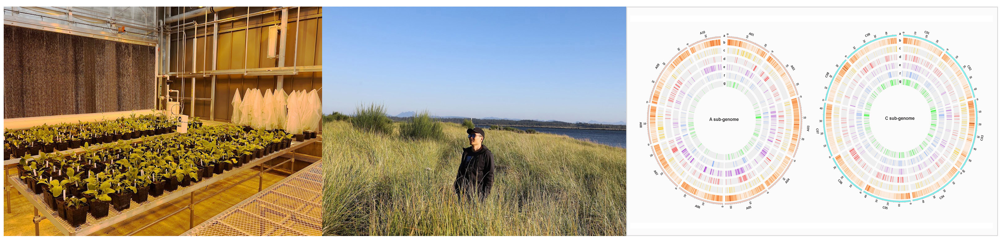

# Bioinformatics, Genomics, and Plants

I am currently a Data Scientist with [Bioinformatics and Analytics Core](https://bioinformatics.missouri.edu/) at the University of Missouri.   
   
Before that, I earned both my BSc and Ph.D. at Huazhong Agricultural University, where I used RNA-seq to elucidate the mechanism of Polima CMS in canola. Then I was a Postdoctoral Fellow and Research Scientist working with [J. Chris Pires](https://bondlsc.missouri.edu/person/j-chris-pires/) at the University of Missouri to study the domestication and diversification process of different Brassica crops by integrating multiple sequencing technologies, and bioinformatic and genomic tools.
   
To learn more about [me](https://anhong11.github.io/About/), my [research](https://anhong11.github.io/Research/), or my [publications](https://anhong11.github.io/Publications/), please click the corresponding links. If you have any questions or would like to get in touch with me, feel free to email me at [anho@missouri.edu](anho@missouri.edu)
   
Have a great day !
